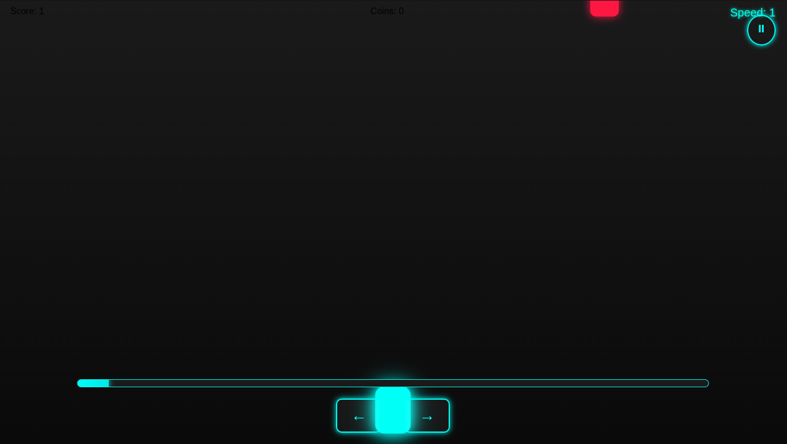

# 🏃‍♂️ Neon Runner Game

A fast-paced **endless runner game** built using HTML, CSS, and JavaScript. Collect coins, avoid obstacles, and survive as long as you can in this neon-lit challenge!

---

## 🔗 Live Demo

🎮 [Play Now](https://techypratik.github.io/Neon-Runner/)  
*(Replace with your actual GitHub Pages link)*

---

## ✨ Features

- ⚡ Smooth player animation
- 🪙 Coin collection with visual effects
- ⏱️ Speed bar indicator
- ⏯️ Play/pause game controls
- 📱 Fully responsive for mobile and desktop
- 🔊 Sound-ready (add effects if desired)
- 🎮 Great for casual arcade fun

---

## 📸 Screenshots:

---

## 🛠 Built With

- HTML5 (Canvas rendering)
- CSS3 (Neon visual styling)
- JavaScript (Game logic, animation)

---

## 📁 Folder Structure

